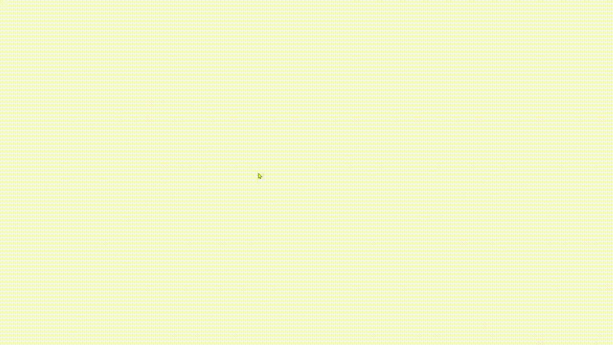

# Post it Library

Post It is a React library that allows you to create and manage sticky notes easily and customizable. It simplifies the creation of interactive user interfaces with notes that can be moved, edited, customized and deleted easily.

<br>



## Installation

To install Post It library:

```bash
  npm install post-it-react
```

## Single post it example 

```tsx
import PostIt from 'post-it-react'

function App () {
  return <PostIt id={'unique-id'} position={{ x: 316, y: 212 }} text={'Hi, I'm a post it! 🧉'} action={'copy'} fill={'#FEE440'} />
}
```

## List post it example 

```tsx
import { useState, useEffect } from 'react'
import PostIt from 'post-it-react'

export default function App () {
  const [postItList, setPostItList] = useState<{ id: string, position: { x: number, y: number }, text: string, fill: string }[]>([])

  useEffect(() => {
    const clickEvent = (e: MouseEvent) => {
      const isPostIt = (e.target as HTMLElement).classList.contains('post-it')
      if (isPostIt) return
      const postItData = {
        id: crypto.randomUUID(),
        position: { x: e.clientX, y: e.clientY },
        text: '',
        fill: '#FEE440'
      }
      setPostItList([...postItList, { ...postItData }])
    }
    window.addEventListener('dblclick', clickEvent)
    return () => window.removeEventListener('dblclick', clickEvent)
  }, [postItList])


  return (
    <>
      {
        postItList.length > 0 && postItList.map(({ id, position, text, fill }) => (
          <PostIt key={id} postItListState={[postItList, setPostItList]} id={id} position={position} text={text} fill={fill} action={'delete'} />
        ))
      }
    </>
  )
}
```

## Table of props

| Prop | Type     | Description | Default | Examples                |
| :-------- | :------- | :------- | :------- | :------------------------- |
| id   | `T` | Set Id unique for post it | - | <ul><li>**Number**: 12345</li><li>**String**: post-it-id-1</li><li>Other values...</li></ul>|
| position   | `{ x: number, y: number }` | Set coords (x/y) for post it position | - | { x: 212, y: 316 } |
| text   | `string` | Set text for post it | "" | Hi, I'm a post it! 🧉 |
| className?   | `string` | Set Css class for post it | post-it-classic | post-it-class |
| fill?   | `string` | Set the background-color of post it | yellow | <ul><li>**ColorName**: yellow</li><li>**Hex**: #EFE9AE</li></ul> |
| color?   | `string` | Set the text color of post it | black | <ul><li>**ColorName**: black</li><li>**Hex**: #000000</li></ul> |
| opacity?   | `number` | Set the opacity of post it (from 0 to 1) | `1` | `0 to 1` |
| rounded?   | `number` | Set the border-radius of post it | `0` | `30` |
| hidden?   | `boolean` | Set the display: hidden for post it if true | `false` | <ul><li>True</li><li>False</li></ul> 
font? | `[number / string(Css unit), {100-900} / {lighter-bolder}, string]` | Set the fontSize (if value is number it will be in px), fontWeight and fontFamily of the post it | ["", "", ""] | <ul><li>['2em', 'bold', '"Inter", sans-serif']</li><li>[18, 600, '"Inter", sans-serif']</li><li>[18, '', '']</li></ul>
| postItListState?   | `[T[], React.Dispatch<React.SetStateAction<T[]>>]` | Set the current state and the state updater function. This allows you to store all the post its and iterate through them | - | `[postItList, setPostItList]` _(Recommended: useState())_ |
| styleBentCorner?   | `boolean` | Set the preset style (styleBentCorner) for post it if true | `false` | <ul><li>True</li><li>False</li></ul>  |
| stylePinned?   | `boolean` | Set the preset style (stylePinned) for post it if true | `false` | <ul><li>True</li><li>False</li></ul>  |
| customPlaceholder?   | `string / string[]` | Set one or more placeholders for post it. (If it is an array, each value will be set randomly) | Write something... | <ul><li>**String**: Write something... </li><li>**Array**: ['Write here', 'Type something', 'I'm thinking about...']</li></ul>  |
| customDefaultText?   | `string` | Set a initial default text for post it | "" | Default text example |
| action?   |  `none / copy / delete / block / [JSX.Element, ((...args: T[]) => T), string, React.CSSProperties?]` | Set a action button with onClick function for post it. <br> - **none**: -. <br> - **copy**: copy (clipboard) the current text of post it. <br> - **delete**: delete the post it. <br> - **block**: block the drag functionality of post it. <br> - **custom**: [Jsx.Element, function, class, style] | none | <ul><li>none</li><li>copy</li><li>delete</li><li>block</li><li>[&lt;span&gt;❗&lt;/span&gt;, handleShowInfo, action-class, { fill: '#EFE9AE' }]</li></ul> |
| actionFixed?   | `boolean` | Set the action button to always be visible | `false` | <ul><li>True</li><li>False</li></ul>  |
| disableEditPostIt?   | `boolean` | Disable the edit functionality of post it if true | `false` |  <ul><li>True</li><li>False</li></ul>  |
| disableDeletePostIt?   | `boolean` | Disable the delete functionality of post it if true | `false` |  <ul><li>True</li><li>False</li></ul>  |
| disableDragPostIt?   | `boolean` | Disable the drag functionality of post it if true | `false` |  <ul><li>True</li><li>False</li></ul>  |


